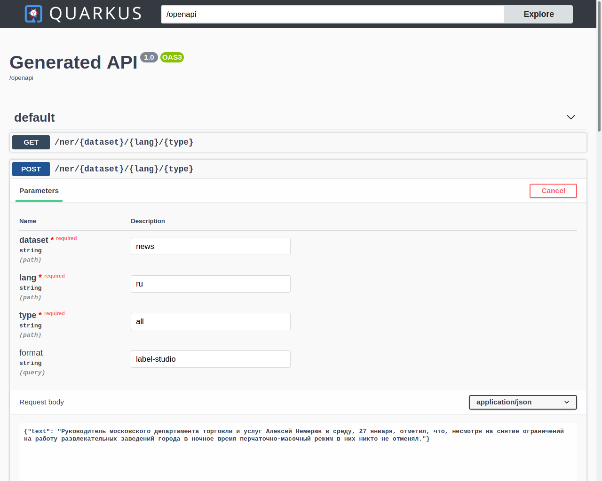

# digator-opennlp

***digator-opennlp*** ("dig" + "gator" + "opennlp") is an API service for different [OpenNLP](https://opennlp.apache.org/) tasks. 

### Features:

* Named Entity extraction (OpenNLP and [Label Studio](https://github.com/heartexlabs/label-studio) output formats).
* Sentence detector.

### Quick start:

```shell
# Start daemon.
user@localhost ~ $ docker run --rm -p 8080:8080 -ti ghcr.io/livelace/digator-opennlp:master-1.8.4
__  ____  __  _____   ___  __ ____  ______ 
 --/ __ \/ / / / _ | / _ \/ //_/ / / / __/ 
 -/ /_/ / /_/ / __ |/ , _/ ,< / /_/ /\ \   
--\___\_\____/_/ |_/_/|_/_/|_|\____/___/   
2021-01-27 19:43:04,071 INFO  [io.quarkus] (main) digator-opennlp 1.0-SNAPSHOT on JVM (powered by Quarkus 1.10.5.Final) started in 1.313s. Listening on: http://0.0.0.0:8080
2021-01-27 19:43:04,122 INFO  [io.quarkus] (main) Profile prod activated. 
2021-01-27 19:43:04,122 INFO  [io.quarkus] (main) Installed features: [cdi, resteasy, resteasy-jsonb, smallrye-health, smallrye-openapi, swagger-ui]

# Named entity extraction (OpenNLP format).

curl -X POST "http://127.0.0.1:8080/ner/news/ru/combined" \
  -H  "accept: application/json" \
  -H  "Content-Type: application/json" \
  -d "{\"text\":\"Руководитель московского департамента торговли и услуг Алексей Немерюк в среду, 27 января, отметил, что, несмотря на снятие ограничений на работу развлекательных заведений города в ночное время перчаточно-масочный режим в них никто не отменял.\"}"
        
# Named entity extraction (Label Studio format).

curl -X POST "http://127.0.0.1:8080/ner/news/ru/combined?format=label-studio" \
  -H  "accept: application/json" \
  -H  "Content-Type: application/json" \
  -d "{\"text\":\"Руководитель московского департамента торговли и услуг Алексей Немерюк в среду, 27 января, отметил, что, несмотря на снятие ограничений на работу развлекательных заведений города в ночное время перчаточно-масочный режим в них никто не отменял.\"}" | jq  

# Sentence segmentation.

curl -X POST "http://127.0.0.1:8080/sentence/news/ru" \
  -H  "accept: application/json" \
  -H  "Content-Type: application/json" \
  -d "{\"text\":\"Как уточняет ИА SakhaNews, инцидент произошел в ноябре 2020 года. Мальчик шел с мамой в детский сад, когда наступил на крышку канализационного колодца.\"}"
```
<br>

### Swagger UI:

Navigate to [http://127.0.0.1:8080/swagger-ui](http://127.0.0.1:8080/swagger-ui) for [Swagger UI](https://swagger.io/tools/swagger-ui/) experience.

